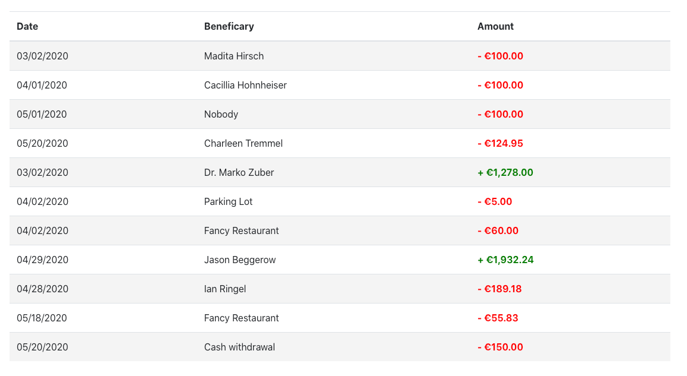
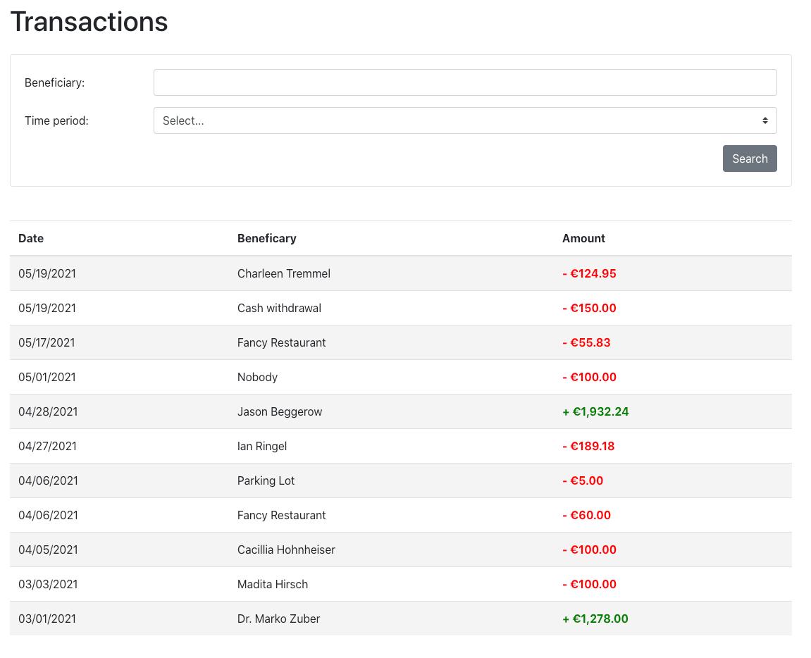

# Banking Frontend Challenge

Welcome to the Banking Frontend Challenge!

The goal of this challenge is to build a small transaction overview screen for a banking application.

## Overview

The following tasks should be solved within the challenge:

* TASK 1: Implement the transaction table
* TASK 2: Implement the filter control for the transactions
* TASK 3: Implement tests for all functionality (optional)

**Non-functional-requirements**
- Ensure a good code structure in regards to SoC (separation of concerns) and Angular best practices
- Use `OnPush` as change detection strategy for your components in combination with the `async` pipe

**Hints**
- You don't need to match the wireframes pixel perfect. The most important part is the data and functionalities
- You don't need to write CSS by yourself. Instead make use of [build-in Bootstrap classes](https://getbootstrap.com/docs/4.5/getting-started/introduction/)
- Prefer to use RxJS technics like Observables instead of an imperative approach
- You don't need to install additional dependencies (like @angular/material). Rather rely on already installed packages

## Prerequisites

- [Node.js® and npm](https://nodejs.org/en/download/) (tested with v20.14.0)

---------------------------

## TASK 1: Implement the transaction table

- Implement a transaction table which contains the following data:
  - Date
  - Beneficiary
  - Amount
- The data in the table should be formatted as shown in the wireframe
- The data should be loaded from the mock API

### Wireframe

[](docs/table.png)

### Mock API Reference

You should load  the transaction data from a local mock API using `HttpClient`:

GET: [http://localhost:3000/transactions](http://localhost:3000/transactions)

(ensure the Mock API is started using the command `npm run start:backend`)

## TASK 2: Implement a filter for the transactions

- Implement a filter for the transactions with the following filter options:
  - Beneficiary (text input)
  - Time period (select control / dropdown list)
    - All
    - Today
    - Last 7 Days
    - Last 30 Days
    - Last 60 Days
- The filter should be applied when clicking on the "Search" button
- The data should be filtered on the backend
- The wireframe shows an example for the UI

Hint: For testing, you may want to update the test data `executionDate` in the test data file `mock.json`

### Wireframe

The filter control should be placed above the transactions table:



### Mock API Reference

You can use the mock API to filter the transactions:

**Examples**:

> Filter for beneficiary which contains 'Restaurant':  
GET [http://localhost:3000/transactions?beneficiary_like=Restaurant](http://localhost:3000/transactions?beneficiary_like=Restaurant)

> Filter for transaction date between 01.04.2021 and 01.05.2021:  
GET [http://localhost:3000/transactions?executionDate_gte=2021-04-01&executionDate_lte=2021-05-01](http://localhost:3000/transactions?executionDate_gte=2021-04-01&executionDate_lte=2021-05-01)

> Filter for beneficiary which contains 'Restaurant' and transaction date between 01.04.2021 and 01.05.2021:  
GET [http://localhost:3000/transactions?beneficiary_like=Restaurant&executionDate_gte=2021-04-01&executionDate_lte=2021-05-01](http://localhost:3000/transactions?beneficiary_like=Restaurant&executionDate_gte=2021-04-01&executionDate_lte=2021-05-01)

(ensure the Mock API is running using the command `npm run start:backend`)

### Date manipulation and formatting

If you need to work with Dates, you can use the already installed library [date-fns](https://date-fns.org/v2.22.1/docs/Getting-Started).

**Examples**:

> Convert a date to an ISO string to the format (yyyy-MM-dd)
```ts
import { formatISO } from 'date-fns';
const dateString = formatISO(new Date(), { representation: 'date' });
```

> Substract 7 days from a given date
```ts
import { subDays } from 'date-fns';
const sevenDaysInThePast = subDays(new Date(), 7);
```


## TASK 3: Implement tests for your code from TASK 1 and TASK 2 (optional)

As an optional task you can also implement Unit Tests for all the code you have written in TASK 1 and TASK 2.

Run `npm run test` to execute the unit tests for the 'feature-transactions' library using [Karma](https://karma-runner.github.io). 

A good starting point is the [official Angular testing documentation](https://angular.io/guide/testing)

---------------------------

## Commands

### Code scaffolding

Run `ng g component my-component --project=feature-transactions` to generate a new component in the `feature-transactions` library.

### Development server

Run `npm start` for a dev server. Navigate to `http://localhost:4200/`. The app will automatically reload if you change any of the source files.

### Mock API

Run `npm run start:backend` for a mock backend server. Navigate to `http://localhost:3000/` to see all available endpoints. 

### Running unit tests

Run `npm run test` to execute the unit tests via [Karma](https://karma-runner.github.io).
